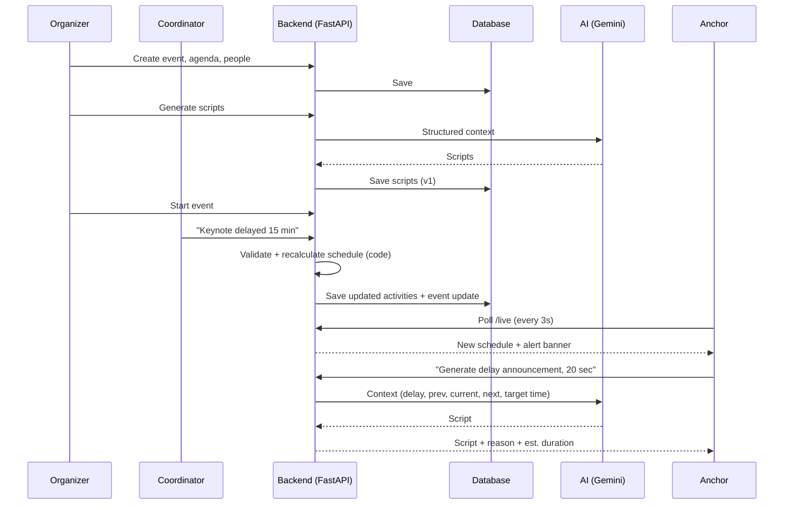
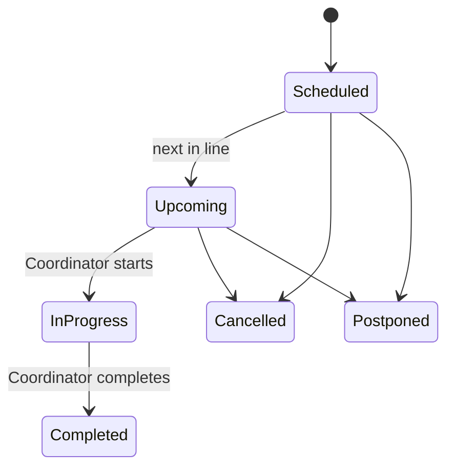
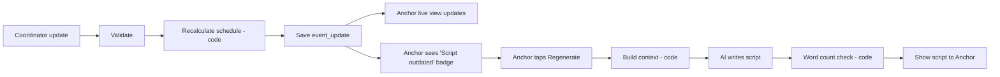
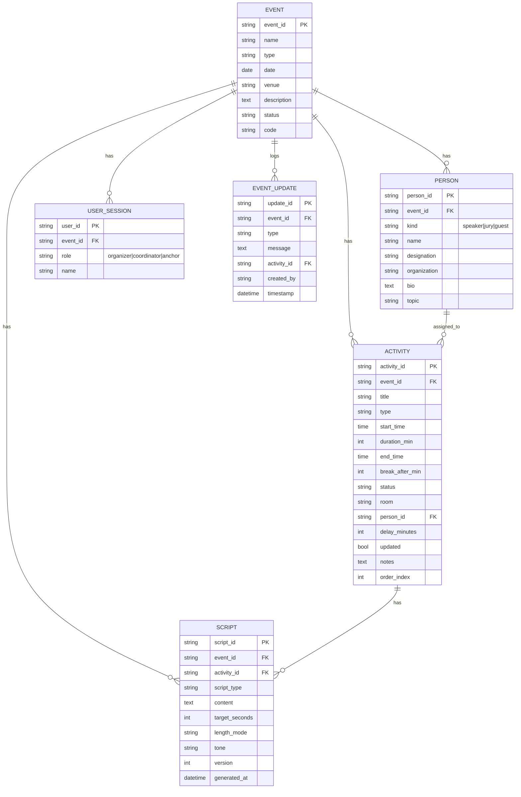
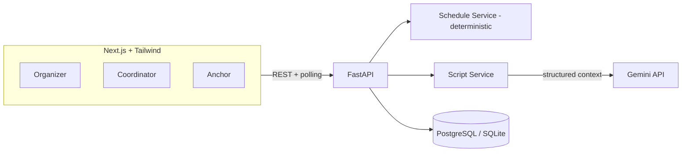

# SMART_STAGE — AI-Powered Event Management + Live Stage Flow + Smart Anchor Assistant

**Hackathon:** PS-5 · Smart Anchor & Stage Flow Management System
**Lifecycle:** `PLAN → PREPARE → RUN → ADAPT`

---

## 1. Product in One Paragraph

SMART_STAGE is a **real-time event operating platform** for college events (hackathons, workshops, seminars, competitions, cultural programs).

- The **Organizer** plans the event and prepares the agenda, people and scripts.
- The **Coordinator** tells the system what is happening in real life (delays, changes, announcements).
- The **Anchor** sees what is happening *now*, what is *next*, what *changed*, and *what to say*.
- **AI** adapts the Anchor's scripts to the live state of the event and the time available to speak.

> It is **not** a chatbot and **not** just a script generator. The event/agenda/live-flow system is the core product; AI is a feature inside that workflow.

### Golden rules
1. **Code owns time.** Schedules, durations, delays and statuses are calculated by normal code, never by the LLM.
2. **AI owns words.** AI only writes/adapts text from structured data we give it.
3. **No invented facts.** AI may only use speaker/event details that were entered into the system.

---

## 2. Roles

| Role | One-line job | Scope |
|---|---|---|
| **Organizer** | Plan, prepare and control the event | Structural changes (agenda, people, scripts, start/stop) |
| **Coordinator** | Report what is happening backstage | Live operational changes only |
| **Anchor** | Run the show on stage | Read-only live view + Smart Scripts |

### Organizer vs Coordinator (important distinction)

| Organizer-level (structural) | Coordinator-level (live operational) |
|---|---|
| Create/edit/delete event | Report delay |
| Build/reorder the agenda | Mark activity started / completed |
| Add/remove speakers, jury, coordinators | Extend/shorten a break |
| Generate & edit scripts | Change room/venue |
| Start/stop the live event | Report cancellation / postponement |
| Any change to activity structure | Send announcement / alert |
| | Flag a speaker replacement, or a new speaker/jury *on the day* (goes to Organizer for approval if it changes the agenda structure) |

---

## 3. User Flows

### Organizer
1. Open **Organizer workspace** → **Create Event** (name, date, type, venue, description).
2. Build **Agenda**: activity name, type, start time, duration, room, assigned speaker/jury.
3. Add **Speakers, Jury, Coordinators**.
4. Review full schedule → **Generate scripts** (AI) → review/edit.
5. Share **Event Code** with Coordinator and Anchor.
6. Press **Start Event** → monitor live.

### Coordinator
1. Join with Event Code → **Live Monitor**.
2. Tap an activity → **Start / Complete / Delay / Change Room / Cancel**.
3. Send an **announcement/alert** if needed.

### Anchor
1. Join with Event Code → **Live Stage** screen.
2. See **Now / Next / What changed**.
3. Open **Smart Script** → pick length or seconds → read.
4. Regenerate when an update arrives.

---

## 4. End-to-End Flow



---

## 5. Code vs AI Responsibilities

| Normal application code (deterministic) | AI (language only) |
|---|---|
| Event/agenda CRUD | Opening script |
| Start/end times, durations, breaks | Speaker introduction |
| Delay calculation & schedule shifting | Transition script |
| Activity status changes | Closing script |
| Permissions & roles | Delay / schedule-change / break announcements |
| Live state sync (polling/WebSocket) | Unexpected announcement wording |
| Input validation | Shorten / expand / change tone |
| Word-count → speaking-time estimate | Short event summary for Anchor |

> ❌ Never ask the LLM "what time will the workshop start now?" — the backend computes it and passes the result in.

---

## 6. State Model

### Activity status



### Flags (kept simple — not separate states)

| Flag | Meaning |
|---|---|
| `delay_minutes > 0` | Activity is delayed (show ⚠️ badge) |
| `updated = true` | Room/speaker/time changed (show 🔄 badge) |

### How state affects the system

| State / Flag | Anchor dashboard | Script Engine |
|---|---|---|
| Scheduled / Upcoming | Shown in "Next" | Intro/transition scripts ready |
| In Progress | Shown in "Now" with timer | Closing/transition to next |
| Completed | Greyed out | Used as "previous activity" context |
| Delayed | ⚠️ banner + new times | Delay announcement with `delay_minutes` |
| Cancelled | Strikethrough + banner | Cancellation announcement + skip transition |
| Postponed | Removed from flow + banner | Schedule-change announcement |
| Updated | 🔄 badge | Schedule-change announcement |

### Event status
`Draft → Ready → Live → Ended`

---

## 7. Deterministic Delay Logic

**Rule (MVP):** a delay of `N` minutes on activity `A` shifts `A` and **every later activity** by `N` minutes.

```python
def apply_delay(activities, activity_id, minutes):
    assert minutes > 0
    idx = index_of(activities, activity_id)
    for a in activities[idx:]:
        if a.status in ("Completed", "Cancelled"):
            continue
        a.start_time += timedelta(minutes=minutes)
        a.end_time   += timedelta(minutes=minutes)
        a.delay_minutes += minutes
        a.updated = True
    save_event_update(type="delay", affected=activity_id, minutes=minutes)
```

Rules:
- Duration must be > 0; delay must be > 0 (reject negatives).
- Completed activities are never changed.
- Every change writes an `event_update` row (who, what, when).
- Multiple quick updates are applied **in order of timestamp**; each is a separate row.
- *Nice-to-have:* "absorb delay into next break" option.

---

## 8. Smart Script Engine (Main AI Feature)

> **"Live Context-Aware Smart Script Adaptation"** — the script changes when the event state changes.

### 8.1 Script types

| # | Type | When used |
|---|---|---|
| 1 | Opening | Start of event |
| 2 | Speaker Introduction | Before a speaker/jury segment |
| 3 | Transition | Between two activities |
| 4 | Closing | End of event |
| 5 | Delay Announcement | After delay update |
| 6 | Schedule Change Announcement | Room/time/speaker/activity change |
| 7 | Break Announcement | Before/after break |
| 8 | Unexpected Announcement | Coordinator's free-text alert → polished script |

### 8.2 Anchor controls

| Control | Options |
|---|---|
| **Length** | Very Short (~15s) · Short (~30s) · Medium (~60s) · Detailed (~90s) |
| **Speaking time** | Custom seconds (e.g. "I have 20 seconds") |
| **Tone** | Formal · Friendly · Energetic |
| **Quick actions** | Shorter · Longer · More formal · Regenerate |

**Time → word budget (code, not AI):**
`target_words ≈ seconds × 2.2` (≈130 words/minute). The backend also re-counts the returned script and estimates its real duration.

### 8.3 Context sent to AI (structured, minimal)

```json
{
  "script_type": "delay_announcement",
  "event": { "name": "TechFest 2026", "type": "Hackathon", "venue": "Main Auditorium" },
  "previous_activity": { "title": "Welcome Address" },
  "current_activity": {
    "title": "Keynote",
    "original_start": "10:20",
    "new_start": "10:35",
    "delay_minutes": 15
  },
  "next_activity": { "title": "Workshop", "new_start": "11:15", "room": "Room B" },
  "speaker": { "name": "Dr. Mehta", "designation": "CTO", "organization": "ABC Technologies", "topic": "Future of AI" },
  "recent_updates": ["Keynote delayed by 15 min (reason: traffic)"],
  "target_duration_seconds": 20,
  "target_words": 44,
  "tone": "friendly"
}
```

**Why structured context?** It keeps output grounded in real data, prevents generic text, reduces tokens, and lets the code (not the model) supply all times.

### 8.4 AI output (JSON)

```json
{
  "script": "Ladies and gentlemen, our keynote by Dr. Mehta will begin about 15 minutes later than planned, at 10:35. Thank you for your patience!",
  "script_type": "delay_announcement",
  "estimated_seconds": 19,
  "reason": "Keynote delayed by 15 minutes (Coordinator update, 10:12)",
  "alternative": "A short 10-second version..."
}
```

### 8.5 System prompt rules (put in backend)

```text
You are a stage script writer for a college event Anchor.
- Use ONLY the data in the provided JSON.
- Never invent qualifications, awards, organizations, achievements or personal details.
- If a detail is missing, omit it.
- Use the times given; do not calculate or change times.
- Keep the script within target_words.
- Return ONLY valid JSON: script, script_type, estimated_seconds, reason, alternative.
```

### 8.6 Adaptation flow



Scripts are **regenerated on demand** (Anchor taps a button), not automatically — this saves API calls and keeps the Anchor in control. Each regeneration creates a new `version`.

### 8.7 AI failure fallback
If AI fails/times out (8s):
1. Show the last saved script version (if any), marked "may be outdated".
2. Otherwise show a **template script** filled with real data:
   `"Please welcome {speaker_name}, {designation} at {organization}, for {activity_title}."`
3. Show a retry button. The live dashboard keeps working — it never depends on AI.

---

## 9. Pages

| Area | Pages |
|---|---|
| **Common** | Landing / Role selection · Join with Event Code |
| **Organizer** | Dashboard (my events) · Create Event · Event Workspace (tabs: **Overview · Agenda · People [Speakers/Jury/Coordinators] · Script Studio · Live Control**) |
| **Coordinator** | **Live Monitor** (activity list + quick actions: Start/Complete/Delay/Room/Break/Cancel) · Announcements & Alerts |
| **Anchor** | **Live Stage** (Now · Next · What Changed · Smart Script panel · Context drawer for speaker/jury) |

> 9 real screens total — the rest of the "pages" in the brief are tabs/panels inside these.

### Anchor Live Stage layout

```text
┌──────────────────────────────────────────────┐
│ TechFest 2026 · Main Auditorium · LIVE       │
├──────────────────────────────────────────────┤
│ ⚠️ Keynote delayed 15 min → now 10:35        │  ← What changed
├──────────────────────┬───────────────────────┤
│ NOW                  │ NEXT                  │
│ Welcome Address      │ Keynote (delayed)     │
│ 10:10–10:20 · 03:12  │ Dr. Mehta · 10:35     │
├──────────────────────┴───────────────────────┤
│ SMART SCRIPT  [Intro|Transition|Delay|...]   │
│ Length: (15s)(30s)(60s)(90s)  Custom: [20]s  │
│ "Ladies and gentlemen, ..."                  │
│ ~19 sec  [Shorter] [Formal] [Regenerate]     │
└──────────────────────────────────────────────┘
```

---

## 10. Permission Matrix

| Action | Organizer | Coordinator | Anchor |
|---|:-:|:-:|:-:|
| Create / edit / delete event | ✅ | ❌ | ❌ |
| Edit agenda (add/edit/delete activity) | ✅ | ❌ | ❌ |
| Manage speakers / jury / coordinators | ✅ | ❌ | ❌ |
| Start / stop live event | ✅ | ❌ | ❌ |
| Report delay | ✅ | ✅ | ❌ |
| Start / complete activity | ✅ | ✅ | ❌ |
| Change break / room / timing | ✅ | ✅ | ❌ |
| Cancel / postpone activity | ✅ | ✅ | ❌ |
| Send announcement / alert | ✅ | ✅ | ❌ |
| Generate / regenerate scripts | ✅ | ❌ | ✅ |
| Edit script text | ✅ | ❌ | ✅ (own view only) |
| View live dashboard | ✅ | ✅ | ✅ |
| Receive live updates | ✅ | ✅ | ✅ |

**MVP auth:** no login system. User enters **Event Code + name + role**. The Organizer gets an **organizer PIN** at event creation; the Coordinator role requires a **coordinator PIN**. Backend checks the role on every request via a simple token returned at join.

---

## 11. Data Model



**Simplifications:** Speakers, Jury and Guests share one `PERSON` table (`kind` field). Coordinators are `USER_SESSION` rows.

---

## 12. API

| Method | Endpoint | Role | Purpose |
|---|---|---|---|
| POST | `/events` | Org | Create event |
| GET | `/events/:id` | All | Event details |
| PUT | `/events/:id` | Org | Edit event |
| POST | `/events/join` | All | Join with code + role → token |
| POST | `/events/:id/activities` | Org | Add activity |
| PUT | `/activities/:id` | Org | Edit activity |
| DELETE | `/activities/:id` | Org | Delete activity |
| POST | `/events/:id/people` | Org | Add speaker/jury/guest |
| PUT/DELETE | `/people/:id` | Org | Edit/remove person |
| POST | `/events/:id/coordinators` | Org | Add coordinator |
| POST | `/events/:id/start` | Org | Event → Live |
| POST | `/events/:id/end` | Org | Event → Ended |
| POST | `/activities/:id/start` | Org, Coord | Mark In Progress |
| POST | `/activities/:id/complete` | Org, Coord | Mark Completed |
| POST | `/events/:id/delay` | Org, Coord | `{activity_id, minutes, reason}` |
| POST | `/activities/:id/change` | Org, Coord | Room / break / timing / cancel / postpone |
| POST | `/events/:id/updates` | Org, Coord | Announcement / alert |
| GET | `/events/:id/live` | All | Full live state (now, next, agenda, latest updates) |
| POST | `/events/:id/scripts/generate` | Org, Anchor | `{activity_id, script_type, length, seconds, tone}` |
| POST | `/scripts/:id/regenerate` | Org, Anchor | New version with `{instruction: "shorter"}` |
| PUT | `/scripts/:id` | Org, Anchor | Manual edit |

### `GET /events/:id/live` response (shape)

```json
{
  "event": { "name": "TechFest 2026", "status": "Live" },
  "now": { "activity_id": "a2", "title": "Welcome Address", "ends_at": "10:20" },
  "next": { "activity_id": "a3", "title": "Keynote", "starts_at": "10:35", "delay_minutes": 15 },
  "agenda": [],
  "updates": [{ "type": "delay", "message": "Keynote delayed by 15 min", "timestamp": "10:12" }],
  "script_outdated": true,
  "server_time": "10:14:05"
}
```

---

## 13. Real-Time Approach

| Option | Use |
|---|---|
| **Polling `GET /live` every 3 seconds (MVP — recommended)** | Simple, reliable, works on any Wi-Fi, enough for a demo |
| WebSocket / SSE | Nice-to-have upgrade; same payload pushed on each update |

The Anchor and Coordinator screens both poll `/live`. The Anchor screen shows a toast when `updates` contains a new item, and a **"Script outdated — Regenerate"** badge when an update affects the current/next activity.

---

## 14. Architecture & Recommended Stack



| Layer | Choice | Why |
|---|---|---|
| Frontend | **Next.js + Tailwind CSS** | Fast UI building, role-based routes |
| Backend | **Python + FastAPI** | Quick, typed, easy Gemini SDK |
| Database | **SQLite for dev → PostgreSQL (Supabase/Neon) if deploying** | Relational data (agenda ↔ people) fits SQL; zero setup with SQLite |
| AI | **Gemini API** (Flash model — fast & cheap) | Server-side only |
| Real-time | **Polling (3s)** | Simplest reliable option |

Backend modules: `events`, `agenda`, `people`, `live` (delay/status logic), `scripts` (context builder + AI call + fallback), `auth` (code + PIN).

---

## 15. Security & Reliability

- API keys live **only in backend env variables**.
- Send AI **only** the needed fields (no PINs, no contact info).
- Check role on every mutating endpoint.
- Validate: durations > 0, delay > 0, start times inside the event day, activity belongs to the event.
- Timestamp every change (`event_update`).
- Show **who** made a change and **why** on the Anchor screen ("Source: Coordinator, 10:12").
- Never let AI output alter the schedule.
- Missing info → omit, never invent.

---

## 16. Edge Cases

| Case | Handling |
|---|---|
| Speaker delayed | `apply_delay`; delay announcement available |
| Speaker absent | Coordinator marks Postponed/Cancelled → schedule-change announcement; next activity moves up only if Organizer confirms |
| Activity cancelled | Status = Cancelled; later activities keep their times (MVP); Anchor sees banner + transition script that skips it |
| Activity added / removed | Organizer only; triggers `updated` flag + update log |
| Break extended | Treated as delay on next activity (+N min) |
| Break shortened | Later activities move earlier only if Organizer confirms (MVP: no auto-advance) |
| Room changed | Update `room`; schedule-change announcement |
| Speaker replaced | Organizer/Coordinator changes `person_id`; intro script marked outdated |
| Jury member added | Added to people list; Anchor sees "➕ New jury member" |
| Organizer edits schedule | Same validation + update log |
| Multiple updates close together | Applied in timestamp order; Anchor sees all in "What changed" list |
| AI API failure | Last version → template fallback → retry button |
| Missing speaker info | Omit missing fields; prompt forbids guessing |
| No internet | Frontend shows "Offline — showing last data" banner; last scripts stay visible |
| Invalid time/duration | 400 error with clear message; nothing saved |
| Anchor joins mid-event | `/live` returns full current state (Now/Next/updates) — no history required |

---

## 17. Example Event — TechFest 2026

**People:** Dr. Mehta (CTO, ABC Technologies — Keynote Speaker, topic: *Future of AI*) · Prof. Shah (Jury) · Ms. Patel (Workshop Speaker)

| Activity | Original | After 15-min Keynote delay |
|---|---|---|
| Opening Ceremony | 10:00–10:10 | 10:00–10:10 |
| Welcome Address | 10:10–10:20 | 10:10–10:20 |
| **Keynote** (Dr. Mehta) | 10:20–11:00 | **10:35–11:15** ⚠️ |
| Workshop (Ms. Patel) | 11:00–12:00 | 11:15–12:15 |
| Break | 12:00–12:20 | 12:15–12:35 |
| Jury Interaction (Prof. Shah) | 12:20– | 12:35– |

---

## 18. Hackathon Scope

### MUST HAVE (MVP)
- Event creation, agenda, speakers, jury, coordinators
- Event Code join + role PIN
- Live dashboard: Now / Next
- Delay handling + automatic schedule recalculation
- Coordinator actions: start, complete, delay, room change, cancel
- Anchor "What changed" feed
- AI: opening, speaker intro, transition, closing, delay announcement
- Script length / seconds control + Shorter/Formal/Regenerate
- Template fallback if AI fails

### NICE TO HAVE
WebSockets · push/sound notifications · voice input · text-to-speech · analytics · event history · full authentication · absorb-delay-into-break · teleprompter mode

### Suggested build order
1. DB + FastAPI CRUD (event, activities, people)
2. `/live` endpoint + delay logic (with unit tests)
3. Organizer UI (create event + agenda)
4. Coordinator Live Monitor
5. Anchor Live Stage (polling)
6. Script Service + prompt + fallback
7. Script controls (length/seconds/tone) + regenerate
8. Polish, seed TechFest demo data

---

## 19. 3–5 Minute Demo

| Time | Part | What to show |
|---|---|---|
| 0:00–1:00 | **Organizer** | Create TechFest 2026 → agenda → people → generate a speaker intro for Dr. Mehta |
| 1:00–2:00 | **Anchor** | Open Live Stage: Now/Next, speaker context, Smart Script |
| 2:00–3:30 | **⭐ Coordinator WOW** | Report "Keynote delayed 15 min" → schedule shifts instantly → Anchor banner appears → tap *Delay Announcement* → AI script → set **20 seconds** → shorter version |
| 3:30–4:30 | **Continue** | Change Workshop room to Room B → Anchor sees update → transition script → generate closing script |
| 4:30–5:00 | **Wrap-up** | "Code controls time. AI adapts the words." |

**Demo tips:** pre-seed TechFest data, keep two browser windows side by side (Coordinator | Anchor), and have the fallback template ready in case the API is slow.

---

## 20. Final Product Statement

SMART_STAGE is not merely an AI script generator. It is a **real-time event operating platform**:

> **Organizer** plans the event.
> **Coordinator** keeps the live event state updated.
> **Anchor** uses live context and AI-generated Smart Scripts to talk to the audience.
> **AI** adapts communication to the event's changing context, timing and available speaking window — while deterministic code always owns the schedule.
