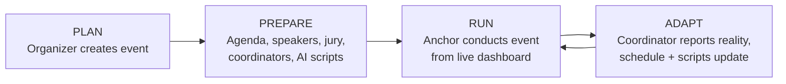
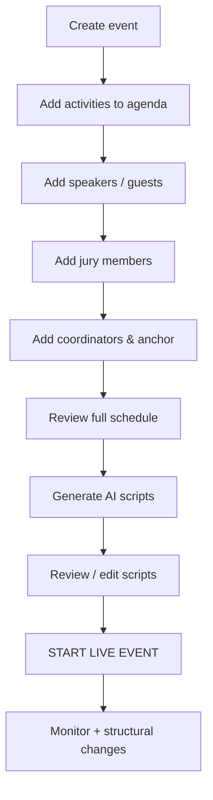
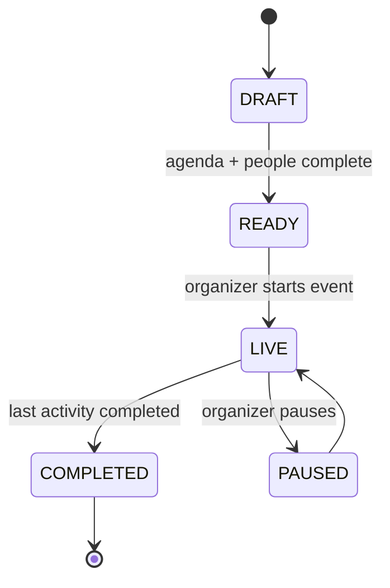
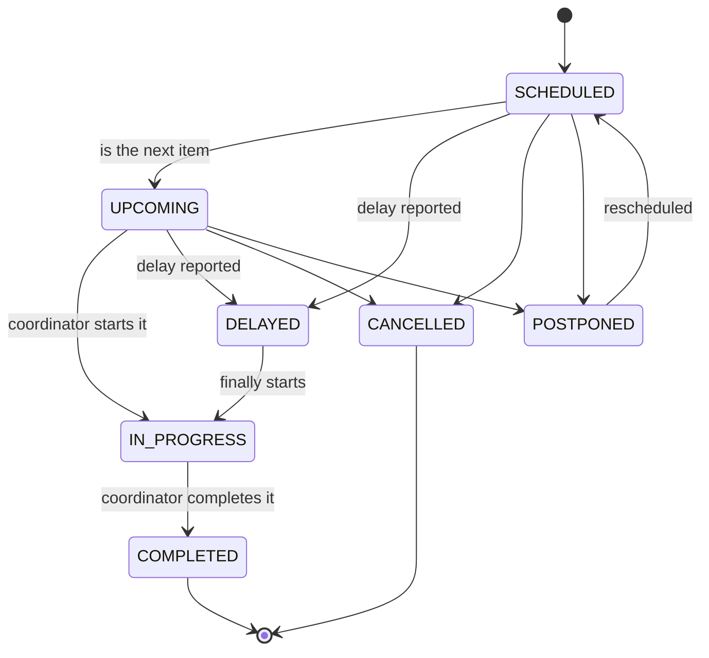
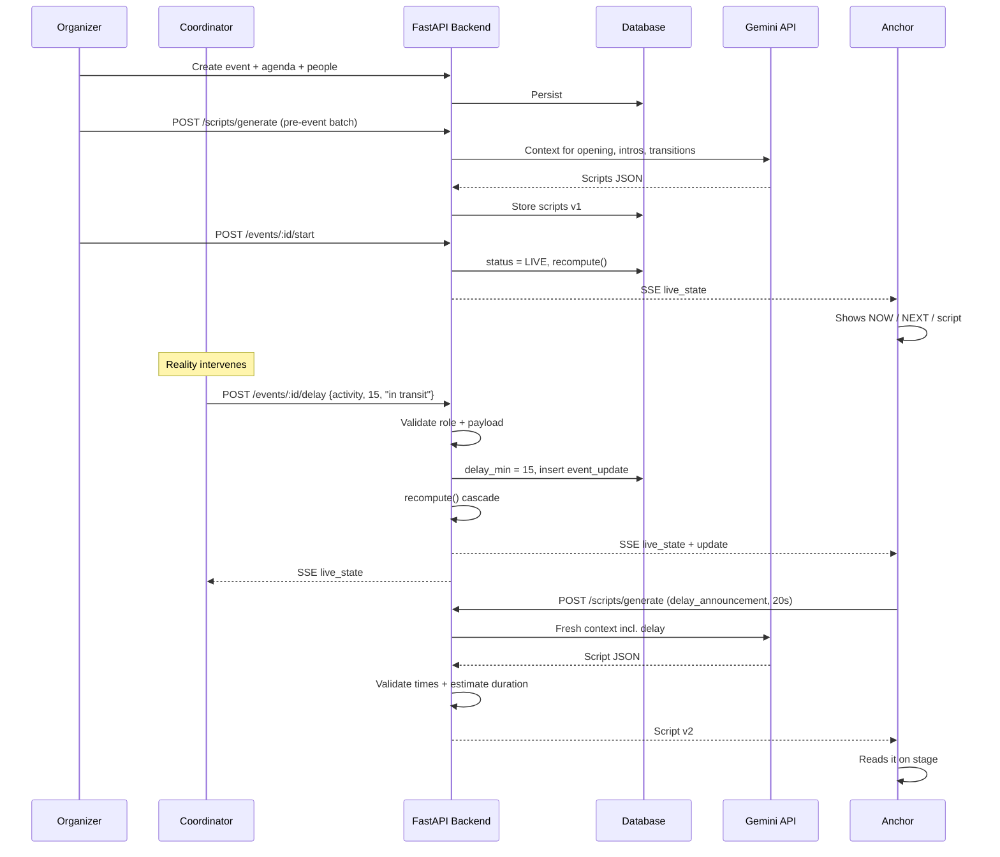
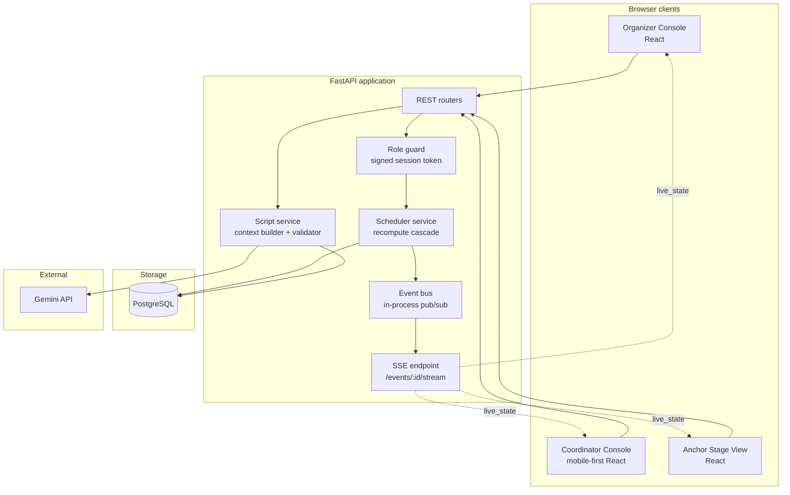
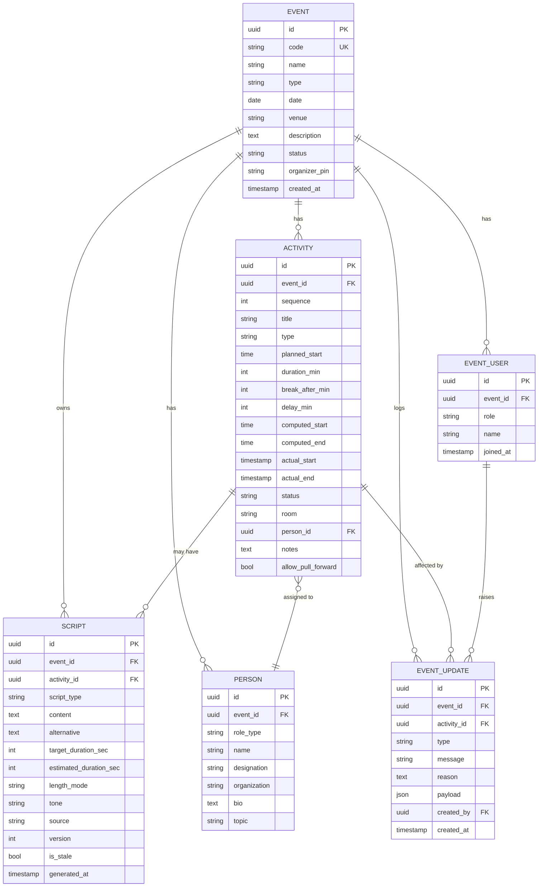
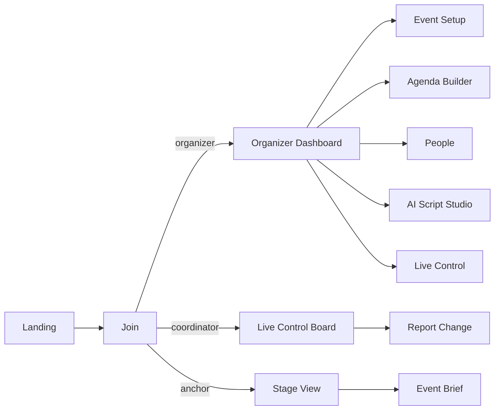

# SMART_STAGE

**AI-Powered Event Management + Live Stage Flow + Smart Anchor Assistant**
Problem Statement: **PS-5 — Smart Anchor & Stage Flow Management System**

> This document is the single implementation reference for the project. A developer should be able to open it and start building without asking further product questions.

---

## Table of Contents

1. [Product Summary](#1-product-summary)
2. [Lifecycle: Plan → Prepare → Run → Adapt](#2-lifecycle-plan--prepare--run--adapt)
3. [The Three Roles](#3-the-three-roles)
4. [Role-Permission Matrix](#4-role-permission-matrix)
5. [Event & Activity State Model](#5-event--activity-state-model)
6. [Deterministic Logic vs AI](#6-deterministic-logic-vs-ai)
7. [Scheduling Engine (Deterministic Core)](#7-scheduling-engine-deterministic-core)
8. [Smart Script Engine (AI Core)](#8-smart-script-engine-ai-core)
9. [Real-Time Event Flow](#9-real-time-event-flow)
10. [System Architecture](#10-system-architecture)
11. [Database Design](#11-database-design)
12. [API Design](#12-api-design)
13. [Real-Time Delivery (SSE + Polling Fallback)](#13-real-time-delivery-sse--polling-fallback)
14. [Pages & Screens](#14-pages--screens)
15. [UI/UX Principles](#15-uiux-principles)
16. [Worked Example — TechFest 2026](#16-worked-example--techfest-2026)
17. [Edge Cases & Error Handling](#17-edge-cases--error-handling)
18. [MVP Scope](#18-mvp-scope)
19. [Recommended Tech Stack](#19-recommended-tech-stack)
20. [Security & Reliability Rules](#20-security--reliability-rules)
21. [Demo Flow (3–5 Minutes)](#21-demo-flow-35-minutes)
22. [Build Plan](#22-build-plan)
23. [Final Product Statement](#23-final-product-statement)

---

## 1. Product Summary

SMART_STAGE is a **real-time event operating platform** for college events — hackathons, workshops, seminars, competitions and cultural programs.

It solves three problems that occur together at every college event:

| Problem | Who feels it | How SMART_STAGE solves it |
|---|---|---|
| The agenda lives in a WhatsApp message and a printed sheet | Organizer | Structured event + agenda model with computed timings |
| Reality drifts from the schedule and nobody knows the real state | Coordinator | One-tap live updates that recompute the schedule |
| The anchor on stage does not know what changed or what to say | Anchor | Live dashboard + context-aware AI scripts sized to available time |

**The product is not an AI script generator.** The event-management and live-state system is the product. The AI sits inside that system and has access to its structured state, which is exactly why the scripts it produces are useful instead of generic.

### One-line pitch

> Organizers plan the event, coordinators keep the live state true, anchors get the exact words to say — regenerated the moment reality changes.

---

## 2. Lifecycle: Plan → Prepare → Run → Adapt



| Phase | Primary actor | System responsibility |
|---|---|---|
| PLAN | Organizer | Store event metadata, create event code |
| PREPARE | Organizer | Agenda CRUD, auto-compute times, people management, pre-generate scripts |
| RUN | Anchor | Serve live state: current, next, script, context |
| ADAPT | Coordinator | Accept updates, recompute schedule, push to anchor, regenerate scripts |

ADAPT loops back into RUN continuously until the event is completed.

---

## 3. The Three Roles

### 3.1 Organizer — owns the structure

The Organizer is responsible for everything that exists *before* the event goes live, and for structural changes during it.

**Workflow**



**Capabilities**

- Create / edit / delete event
- Manage agenda: add, edit, delete, reorder activities
- Manage speakers, jury, coordinators, anchor
- Generate and edit AI scripts (AI Script Studio)
- View event summary
- Start and end the live event
- Make structural schedule changes while live (add/remove an activity, replace a speaker)

### 3.2 Coordinator — owns the live truth

The Coordinator is the backstage operations user. Their single job:

> **Tell the system what is actually happening right now.**

They never redesign the event. They report reality, and the system recomputes.

**Coordinator action catalogue**

| Category | Actions | System effect |
|---|---|---|
| Flow control | Start activity, complete activity | Status change + `actual_start` / `actual_end` recorded |
| Delay | Report delay (minutes + optional reason) | Cascade recompute of downstream activities |
| Timing | Extend / shorten break, change duration | Recompute from that activity forward |
| Logistics | Change room / venue for an activity | Update activity, raise `ROOM_CHANGE` update |
| Disruption | Cancel activity, postpone activity | Status change, downstream pull-forward or hold |
| People | Speaker absent, speaker replaced, add jury member, add coordinator | Update people, raise `PEOPLE_CHANGE` update |
| Announcements | Unexpected / operational / emergency announcement | Raise `ANNOUNCEMENT` update with free text |

**Explicitly NOT coordinator-level:** creating or deleting the event, deleting activities outright, rewriting the whole agenda, changing roles/permissions. A coordinator can *cancel* an activity (a fact about reality) but cannot *delete* it (a change to the plan). That single distinction keeps the model clean:

| | Organizer | Coordinator |
|---|---|---|
| Changes the **plan** | ✅ | ❌ |
| Records the **reality** | ✅ | ✅ |
| Example | "Remove the workshop from the agenda" | "The workshop is cancelled — the speaker did not arrive" |

### 3.3 Anchor — owns the stage

The Anchor needs four answers, always visible, never more than one scroll away:

> **What is happening now? · What happens next? · What changed? · What should I say?**

**Anchor screen contains**

1. **Event header** — name, type, venue, date, live status, elapsed vs scheduled drift
2. **NOW card** — activity name, person, scheduled start, expected end, status, live countdown
3. **NEXT card** — activity name, person, scheduled time, one-line context
4. **Update feed** — coordinator updates newest-first, unread badged
5. **Smart Script panel** — current script, type selector, length/time controls, regenerate

**Update examples the anchor sees**

```text
⚠️  Keynote delayed by 15 minutes — speaker in transit
📍  Workshop moved to Room B
⏰  Break extended by 10 minutes
🔄  Speaker changed: Dr. Mehta → Ms. Patel
➕  New jury member added: Prof. Iyer
📢  Announcement: Parking on the north gate is now open
```

Each update carries: icon, message, affected activity, timestamp, and who raised it. When an update changes what the anchor must say, the script panel shows a **"Script updated"** badge with a one-tap "Read the new version" action.

---

## 4. Role-Permission Matrix

`✅` allowed · `⚠️` allowed with restriction · `❌` denied

| Action | Organizer | Coordinator | Anchor |
|---|:---:|:---:|:---:|
| Create event | ✅ | ❌ | ❌ |
| Edit event details | ✅ | ❌ | ❌ |
| Delete event | ✅ | ❌ | ❌ |
| Add / edit activity | ✅ | ⚠️ timing & room only | ❌ |
| Delete activity | ✅ | ❌ | ❌ |
| Reorder agenda | ✅ | ❌ | ❌ |
| Manage speakers | ✅ | ⚠️ mark absent / replace | ❌ |
| Manage jury | ✅ | ⚠️ add only | ❌ |
| Manage coordinators / anchor | ✅ | ❌ | ❌ |
| Start / end live event | ✅ | ❌ | ❌ |
| Start / complete activity | ✅ | ✅ | ❌ |
| Report delay | ✅ | ✅ | ❌ |
| Cancel / postpone activity | ✅ | ✅ | ❌ |
| Change room / venue | ✅ | ✅ | ❌ |
| Post announcement | ✅ | ✅ | ❌ |
| Generate scripts | ✅ | ❌ | ✅ |
| Edit / save scripts | ✅ | ❌ | ⚠️ own working copy |
| View live dashboard | ✅ | ✅ | ✅ |
| Receive live updates | ✅ | ✅ | ✅ |

### Access model (deliberately light for the MVP)

No passwords, no OAuth. Each event has a **6-character event code**; each role gets its own join link.

```text
/join/TF2026?role=organizer   → requires the organizer PIN shown at creation
/join/TF2026?role=coordinator → open link, user types their name
/join/TF2026?role=anchor      → open link, user types their name
```

The server issues a signed session token carrying `{event_id, role, user_id}`. **Every write endpoint checks the role in the token against the matrix above** — the frontend hiding a button is never the security boundary. This is enough for a hackathon and still demonstrates a real permission model.

---

## 5. Event & Activity State Model

### Event states



### Activity states



> `UPDATED` is **not** a state. It is a transient flag (`last_updated_at` + an entry in `event_updates`) so an activity can be simultaneously `IN_PROGRESS` and recently updated. Treating it as a state creates ambiguity.

### How each state affects the two consumers

| State | Anchor dashboard | Script engine |
|---|---|---|
| `SCHEDULED` | Listed in the agenda, muted | No script needed yet |
| `UPCOMING` | Shown in the **NEXT** card | Transition + introduction pre-generated |
| `IN_PROGRESS` | Shown in the **NOW** card with countdown | Introduction already used; transition armed |
| `DELAYED` | Amber banner + new expected time | Triggers `delay_announcement` generation |
| `COMPLETED` | Greyed, moves out of NOW | Closing/transition to next becomes active |
| `CANCELLED` | Struck through, red badge | Triggers `schedule_change_announcement`; skipped in transitions |
| `POSTPONED` | Moved to "Later today" bucket | Triggers `schedule_change_announcement` |

---

## 6. Deterministic Logic vs AI

This separation is the single most important engineering decision in the project. An LLM must never be asked to do arithmetic on the schedule.

```mermaid
flowchart LR
    subgraph DET["Deterministic backend — the source of truth"]
        D1[Event & agenda CRUD]
        D2[Start / end / duration math]
        D3[Delay cascade recompute]
        D4[Activity status transitions]
        D5[Permissions & roles]
        D6[Live state assembly]
        D7[Update feed & timestamps]
    end
    subgraph AI["LLM — language only"]
        L1[Opening / closing scripts]
        L2[Speaker introductions]
        L3[Transitions]
        L4[Delay & change announcements]
        L5[Shorten / lengthen / re-tone]
        L6[Event summary]
    end
    DET -->|structured JSON context| AI
    AI -->|text back| DET
```



| Concern | Owner | Why |
|---|---|---|
| "The keynote now starts at 10:35" | Deterministic | Must be exact, reproducible, testable |
| "Everything after the keynote shifts by 15 min" | Deterministic | Cascade rules are business logic, not prose |
| "Ladies and gentlemen, the keynote will begin shortly…" | AI | Natural language, tone, length |
| "This intro must fit in 20 seconds" | Both | Backend passes the constraint; AI writes to it; backend estimates the spoken duration back |
| "Who is on stage right now" | Deterministic | Derived from status, never guessed |

**Rule:** the AI is a *renderer of state into speech*. It receives state and returns words. It never writes to the schedule.

---

## 7. Scheduling Engine (Deterministic Core)

### 7.1 Time fields per activity

| Field | Meaning |
|---|---|
| `planned_start` | What the organizer typed |
| `duration_min` | Planned length |
| `break_after_min` | Buffer after this activity |
| `delay_min` | Accumulated delay applied to this activity |
| `computed_start` | Live start time after cascade (derived) |
| `computed_end` | `computed_start + duration_min` (derived) |
| `actual_start` | Set when coordinator marks it started |
| `actual_end` | Set when coordinator marks it completed |

`computed_*` are **always recalculated**, never hand-edited.

### 7.2 Cascade recompute algorithm

```python
def recompute(activities):
    """activities: ordered by sequence. Returns the same list with computed times."""
    cursor = None
    for a in activities:
        if a.status in ("CANCELLED", "POSTPONED"):
            a.computed_start = a.computed_end = None
            continue

        if a.actual_start:                       # reality wins
            start = a.actual_start
        elif cursor is None:                     # first live item
            start = a.planned_start + minutes(a.delay_min)
        else:
            # never pull an activity earlier than planned unless allowed
            natural = max(cursor, a.planned_start)
            start = natural + minutes(a.delay_min)

        end = a.actual_end or (start + minutes(a.duration_min))
        a.computed_start, a.computed_end = start, end
        cursor = end + minutes(a.break_after_min)
    return activities
```

**Design decisions encoded above**

1. **Actual beats planned.** Once something really started, that timestamp anchors everything after it.
2. **No accidental pull-forward.** `max(cursor, planned_start)` means finishing early does not drag the next session earlier — the audience is not there yet. An organizer can explicitly opt in per activity with `allow_pull_forward = true`.
3. **Delay is additive and idempotent per report.** Reporting "delayed 15" then "delayed 25" *sets* `delay_min = 25`, it does not add to 40. The UI says "Total delay", not "Add delay". This is exactly the scenario in the demo.
4. **Cancelled items are skipped**, and their `break_after_min` is skipped with them.
5. Recompute runs on **every** write that touches timing, inside the same transaction, and the resulting `live_state` is what gets broadcast.

### 7.3 Derived values exposed to the UI

| Value | Formula |
|---|---|
| `drift_min` | `computed_start(next_upcoming) − planned_start(next_upcoming)` |
| `remaining_sec` | `computed_end(current) − now` |
| `overrun_sec` | `now − computed_end(current)` when positive |
| `gap_to_next_sec` | `computed_start(next) − now` — this is the anchor's **speaking window** |

`gap_to_next_sec` is the number that gets fed to the AI as `available_seconds`. It is the bridge between the scheduler and the script engine, and it is what makes the "I have only 20 seconds" feature actually intelligent rather than a manual dropdown.

### 7.4 Validation rules

- `duration_min >= 1`, `break_after_min >= 0`, `delay_min >= 0`
- `planned_start` must fall on the event date
- Overlapping planned activities → warning at save time, not a hard block (parallel tracks exist)
- Any update arriving for a `COMPLETED` activity is rejected with `409`
- All writes stamp `updated_at` and `updated_by`

---

## 8. Smart Script Engine (AI Core)

### 8.1 Script types

| # | Type | Trigger | Typical length |
|---|---|---|---|
| 1 | `opening` | Event start | 45–90 s |
| 2 | `speaker_introduction` | Before a speaker activity | 20–60 s |
| 3 | `transition` | Between two activities | 10–30 s |
| 4 | `closing` | Last activity | 45–90 s |
| 5 | `delay_announcement` | Delay reported | 15–30 s |
| 6 | `schedule_change_announcement` | Cancel / postpone / reorder / room change | 15–30 s |
| 7 | `break_announcement` | Break starts or is extended | 15–25 s |
| 8 | `unexpected_announcement` | Free-text announcement from coordinator | 10–30 s |

### 8.2 The context object

The AI never receives the raw database and never receives free-form chat history. It receives a tight, structured snapshot assembled by the backend:

```json
{
  "script_type": "delay_announcement",
  "event": {
    "name": "TechFest 2026",
    "type": "Technical Festival",
    "venue": "Main Auditorium, Block A",
    "date": "2026-02-14",
    "audience": "college students and faculty",
    "tone": "warm_formal",
    "language": "en"
  },
  "previous_activity": {
    "title": "Welcome Address",
    "person": "Dr. Rao (Principal)",
    "status": "COMPLETED"
  },
  "current_activity": {
    "title": "Keynote: Future of AI",
    "person_id": "sp_01",
    "status": "DELAYED",
    "planned_start": "10:20",
    "computed_start": "10:35",
    "delay_min": 15
  },
  "next_activity": {
    "title": "Workshop: Building with LLMs",
    "person": "Ms. Patel",
    "computed_start": "11:15",
    "room": "Room B"
  },
  "people": [
    {
      "id": "sp_01",
      "name": "Dr. Mehta",
      "designation": "CTO",
      "organization": "ABC Technologies",
      "topic": "Future of AI",
      "bio": null
    }
  ],
  "recent_updates": [
    { "type": "DELAY", "message": "Keynote delayed 15 min", "reason": "speaker in transit", "at": "10:18" }
  ],
  "constraints": {
    "available_seconds": 25,
    "target_duration_seconds": 20,
    "length_mode": "short",
    "must_mention": ["revised start time", "next activity"],
    "must_not_invent": true
  }
}
```

**Why structured context matters**

1. **Grounding** — every fact in the script traces back to a field. Nothing is recalled from the model's own knowledge.
2. **Determinism where it counts** — times and names arrive pre-computed as strings, so the model copies rather than calculates.
3. **Token economy** — a snapshot is ~600 tokens; the whole event is thousands. Cheaper, faster, and more accurate.
4. **Testability** — the same context must always yield an equivalent script. You can snapshot-test the prompt.
5. **Privacy** — only the fields listed above ever leave the server.

### 8.3 The AI response contract

The model is instructed to return **JSON only**:

```json
{
  "script": "Ladies and gentlemen, a brief update — our keynote with Dr. Mehta will now begin at 10:35. Please stay seated, we'll be under way in just a few minutes.",
  "script_type": "delay_announcement",
  "estimated_duration_seconds": 19,
  "context_note": "Reflects the 15-minute keynote delay reported at 10:18.",
  "alternative": "Just a quick note — the keynote starts at 10:35. Thank you for your patience."
}
```

The backend **recomputes** `estimated_duration_seconds` itself rather than trusting the model:

```python
WORDS_PER_MINUTE = 130          # calibrated stage pace for Indian college events
def estimate_seconds(text):
    return round(len(text.split()) / WORDS_PER_MINUTE * 60)
```

If the estimate overshoots `target_duration_seconds` by more than 25%, the backend automatically issues **one** shortening retry before returning. The anchor should never receive a script that does not fit the window they asked for.

### 8.4 Length and time control

Two controls, one shared mechanism.

| Length mode | Word budget | Use |
|---|---|---|
| Very Short | ~20 words | One-liner bridge |
| Short | ~45 words | Standard transition / announcement |
| Medium | ~90 words | Speaker introduction |
| Detailed | ~180 words | Opening / closing ceremony |

Or the anchor types a time directly — **"I have 20 seconds"** — and the backend converts it:

```text
word_budget = target_seconds × (130 / 60) ≈ target_seconds × 2.17
```

The word budget goes into the prompt as a hard instruction, and the post-check above enforces it. The **"Use my actual gap"** button fills the field with `gap_to_next_sec` straight from the scheduler — the anchor does not have to know how much time they have; the system already does.

### 8.5 Quick actions (the anchor's one-tap AI)

Each is a re-generation with the same context plus one modifier, not a chat turn:

| Button | Modifier sent |
|---|---|
| Make it shorter | `length_mode` drops one level |
| Make it longer | `length_mode` rises one level |
| More formal | `tone = formal` |
| More casual | `tone = casual` |
| I have 20 seconds | `target_duration_seconds = 20` |
| Bridge to next activity | `script_type = transition` |
| Regenerate | same input, new sample |

Every generation is stored as a new **version** of the script, so the anchor can flip back to the previous one — essential when a regeneration comes out worse thirty seconds before going on stage.

### 8.6 Anti-hallucination guardrails

The system prompt states, and the code enforces:

1. Use **only** the fields supplied. Never add qualifications, awards, degrees, organizations, publications or achievements.
2. If `bio` is `null`, introduce the speaker from name, designation, organization and topic alone.
3. If a field is missing, **omit** it — never fill it with a plausible phrase.
4. Never state a time that is not present in the context.
5. Never invent an explanation for a delay; use `reason` if supplied, otherwise stay neutral.
6. Output JSON only, no markdown fences, no preamble.

**Backend post-validation** before the script reaches the anchor:

- Extract all `HH:MM` patterns from the output → each must appear in the context. Otherwise regenerate once, then fall back to the template.
- Check for banned credential words (`award-winning`, `renowned`, `PhD`, `pioneer`, `visionary`, `celebrated`) when the corresponding field is absent.
- Names in the output must match `people[].name` by fuzzy comparison.

The UI shows a small **"Grounded in event data"** chip on scripts that pass, which is a genuinely good thing to point at during judging.

### 8.7 Template fallback (works with zero internet)

Every script type has a deterministic template. If the AI API fails, times out, is rate-limited or the venue Wi-Fi dies, the backend fills the template and returns it with `"source": "template"`. The anchor sees a small offline badge, and **the demo never breaks**.

```text
delay_announcement template:
"Ladies and gentlemen, a quick update — {activity_title} will now begin at
{computed_start}{reason_clause}. Our next session, {next_title}, follows at
{next_start}. Thank you for your patience."
```

This is worth ten minutes of build time and removes the largest single demo risk.

---

## 9. Real-Time Event Flow



### Flow in words

1. **Organizer plans** — event, agenda, speakers, jury, coordinators, anchor.
2. **Scripts pre-generated** — opening, all introductions, all transitions, closing are batch-generated while there is time and connectivity. This is the preparation payoff.
3. **Event starts** — organizer flips the event to `LIVE`; the scheduler produces the first `live_state`.
4. **Coordinator observes reality** — starts/completes activities, reports what changes.
5. **Backend is the single writer** — validates the role, persists the change, appends an `event_update`, runs `recompute()`, produces a new `live_state`.
6. **Live state broadcasts** — every connected client receives the same snapshot. No client computes schedule math.
7. **AI re-enters** — for updates that change what must be said, the backend flags `script_stale = true` on the affected script. The anchor taps regenerate (or it auto-generates for delays, which is the demo moment).
8. **Anchor speaks** — with the revised time, the revised next activity, and the reason, in the number of seconds actually available.

---

## 10. System Architecture



**Architectural rules**

- The **backend is the only place schedule math happens**. Clients render `live_state` and nothing more.
- The **event bus is in-process** (an `asyncio` dict of subscriber queues keyed by `event_id`). No Redis, no Celery, no message broker. For a hackathon running one server process with a handful of clients, this is correct, not lazy.
- The **AI call is server-side only**. The API key never reaches the browser.
- Script generation is **never** in the critical path of a schedule update. The schedule updates instantly; the script arrives a second or two later.

---

## 11. Database Design



### Table notes

| Table | Notes |
|---|---|
| `event` | `code` is the 6-char join code. `organizer_pin` is a 4-digit code shown once at creation. |
| `activity` | `sequence` drives ordering, not `planned_start` — reordering must not depend on times. `computed_*` are cached derivations, refreshed on every recompute. |
| `person` | One table for speakers, guests and jury, separated by `role_type ∈ {SPEAKER, GUEST, JURY, CHIEF_GUEST}`. Two near-identical tables would be needless duplication. |
| `event_user` | Coordinators and anchors who joined via link. `created_by` on updates points here, giving full attribution. |
| `script` | Versioned by `(activity_id, script_type, version)`. Never update in place — insert a new version. `source ∈ {ai, template, manual}`. |
| `event_update` | Append-only. This is both the anchor's feed and the event's audit log. Never delete a row. |

**Enums**

```text
event.status      : DRAFT | READY | LIVE | PAUSED | COMPLETED
activity.status   : SCHEDULED | UPCOMING | IN_PROGRESS | COMPLETED | DELAYED | CANCELLED | POSTPONED
activity.type     : CEREMONY | TALK | KEYNOTE | WORKSHOP | PANEL | BREAK | JUDGING | PERFORMANCE | OTHER
person.role_type  : SPEAKER | GUEST | JURY | CHIEF_GUEST
event_user.role   : ORGANIZER | COORDINATOR | ANCHOR
update.type       : DELAY | ACTIVITY_START | ACTIVITY_COMPLETE | CANCEL | POSTPONE |
                    ROOM_CHANGE | TIME_CHANGE | BREAK_CHANGE | PEOPLE_CHANGE | ANNOUNCEMENT
script.type       : opening | speaker_introduction | transition | closing |
                    delay_announcement | schedule_change_announcement |
                    break_announcement | unexpected_announcement
```

---

## 12. API Design

Base: `/api`. All endpoints require `Authorization: Bearer <session_token>` except join/create.

### Access

| Method | Path | Role | Purpose |
|---|---|---|---|
| POST | `/events` | — | Create event, returns `code` + `organizer_pin` + token |
| POST | `/events/:code/join` | — | Join with `{role, name, pin?}`, returns session token |
| GET | `/me` | any | Resolve token → `{event_id, role, name}` |

### Event & agenda

| Method | Path | Role | Purpose |
|---|---|---|---|
| GET | `/events/:id` | any | Full event with agenda + people |
| PUT | `/events/:id` | Organizer | Edit event details |
| DELETE | `/events/:id` | Organizer | Delete event |
| POST | `/events/:id/activities` | Organizer | Add activity |
| PUT | `/activities/:id` | Organizer | Edit activity |
| DELETE | `/activities/:id` | Organizer | Delete activity |
| POST | `/events/:id/activities/reorder` | Organizer | `{ordered_ids: []}` |

### People

| Method | Path | Role | Purpose |
|---|---|---|---|
| POST | `/events/:id/people` | Organizer, Coordinator* | Add person (`role_type` in body) |
| PUT | `/people/:id` | Organizer | Edit person |
| DELETE | `/people/:id` | Organizer | Remove person |
| GET | `/events/:id/people` | any | List, filterable by `role_type` |

\* Coordinator may add `JURY` only; enforced server-side.

### Live control

| Method | Path | Role | Purpose |
|---|---|---|---|
| POST | `/events/:id/start` | Organizer | `DRAFT/READY → LIVE` |
| POST | `/events/:id/end` | Organizer | `LIVE → COMPLETED` |
| GET | `/events/:id/live` | any | Current `live_state` snapshot (polling fallback) |
| GET | `/events/:id/stream` | any | **SSE** stream of `live_state` + updates |
| POST | `/activities/:id/start` | Organizer, Coordinator | Set `IN_PROGRESS`, stamp `actual_start` |
| POST | `/activities/:id/complete` | Organizer, Coordinator | Set `COMPLETED`, stamp `actual_end` |
| POST | `/activities/:id/delay` | Organizer, Coordinator | `{delay_min, reason?}` → cascade |
| POST | `/activities/:id/cancel` | Organizer, Coordinator | `{reason?}` |
| POST | `/activities/:id/postpone` | Organizer, Coordinator | `{reason?}` |
| PATCH | `/activities/:id/timing` | Organizer, Coordinator | `{duration_min?, break_after_min?}` |
| PATCH | `/activities/:id/room` | Organizer, Coordinator | `{room}` |
| POST | `/events/:id/announcements` | Organizer, Coordinator | `{message, severity}` |
| GET | `/events/:id/updates` | any | Update feed, `?since=<ts>` |

### Scripts

| Method | Path | Role | Purpose |
|---|---|---|---|
| POST | `/events/:id/scripts/generate` | Organizer, Anchor | Generate one script (body below) |
| POST | `/events/:id/scripts/generate-batch` | Organizer | Pre-generate opening + all intros + transitions + closing |
| POST | `/scripts/:id/regenerate` | Organizer, Anchor | New version with modifiers |
| PUT | `/scripts/:id` | Organizer, Anchor | Manual edit → new version, `source = manual` |
| GET | `/activities/:id/scripts` | any | All scripts for an activity, newest version first |
| GET | `/scripts/:id/versions` | any | Version history |

**Generate request**

```json
{
  "script_type": "speaker_introduction",
  "activity_id": "act_03",
  "target_duration_seconds": 30,
  "length_mode": "short",
  "tone": "warm_formal",
  "language": "en"
}
```

**Generate response**

```json
{
  "id": "scr_11",
  "version": 2,
  "script_type": "speaker_introduction",
  "content": "Our keynote speaker this morning is Dr. Mehta, CTO of ABC Technologies, who will be speaking on the Future of AI. Please join me in welcoming him to the stage.",
  "alternative": "Please welcome Dr. Mehta, CTO of ABC Technologies, on the Future of AI.",
  "estimated_duration_seconds": 13,
  "target_duration_seconds": 30,
  "context_note": "Built from speaker profile; no delay in effect.",
  "source": "ai",
  "grounded": true
}
```

### `live_state` payload — the single object the whole live UI renders from

```json
{
  "event": { "id": "...", "name": "TechFest 2026", "status": "LIVE", "venue": "Main Auditorium" },
  "server_time": "2026-02-14T10:22:41+05:30",
  "drift_min": 15,
  "current": {
    "activity_id": "act_03", "title": "Keynote: Future of AI", "person": "Dr. Mehta",
    "status": "DELAYED", "planned_start": "10:20", "computed_start": "10:35",
    "computed_end": "11:15", "remaining_sec": null, "delay_min": 15
  },
  "next": {
    "activity_id": "act_04", "title": "Workshop: Building with LLMs", "person": "Ms. Patel",
    "computed_start": "11:15", "room": "Room B"
  },
  "gap_to_next_sec": 740,
  "agenda": [ { "activity_id": "act_01", "title": "Opening Ceremony", "status": "COMPLETED", "computed_start": "10:00" } ],
  "recent_updates": [
    { "id": "u_08", "type": "DELAY", "message": "Keynote delayed by 15 minutes",
      "reason": "speaker in transit", "activity_id": "act_03",
      "created_by": "Rahul (Coordinator)", "created_at": "10:18" }
  ],
  "script_flags": { "act_03": { "stale": true, "reason": "delay_reported" } }
}
```

Note `server_time`: countdowns are computed against the **server clock offset**, so a laptop with the wrong time does not show the anchor a wrong countdown.

### Status codes

| Code | When |
|---|---|
| 400 | Invalid payload (negative duration, malformed time) |
| 401 | Missing/expired token |
| 403 | Role not permitted for this action |
| 404 | Event / activity not found |
| 409 | Illegal state transition (e.g. delaying a `COMPLETED` activity) |
| 502 | AI provider failed **after** the template fallback also failed (should be effectively unreachable) |

---

## 13. Real-Time Delivery (SSE + Polling Fallback)

WebSockets are bidirectional. This system's realtime need is strictly **one-way: server → clients**. Every client write already goes over plain REST. So **Server-Sent Events** is the right fit — less code, auto-reconnect built into the browser, plain HTTP, works through campus proxies.

```python
@router.get("/events/{event_id}/stream")
async def stream(event_id: str, request: Request, user=Depends(role_any)):
    queue = bus.subscribe(event_id)
    async def gen():
        yield sse("live_state", build_live_state(event_id))   # immediate snapshot
        try:
            while not await request.is_disconnected():
                try:
                    msg = await asyncio.wait_for(queue.get(), timeout=15)
                    yield sse(msg["event"], msg["data"])
                except asyncio.TimeoutError:
                    yield ": keepalive\n\n"                    # hold the connection open
        finally:
            bus.unsubscribe(event_id, queue)
    return StreamingResponse(gen(), media_type="text/event-stream")
```

Client:

```js
const es = new EventSource(`/api/events/${id}/stream`);
es.addEventListener("live_state", e => setState(JSON.parse(e.data)));
es.addEventListener("update",     e => pushToast(JSON.parse(e.data)));
es.onerror = () => startPolling();   // browser also auto-reconnects
```

**Fallback:** if SSE fails to connect within 5 seconds, or errors twice, the client falls back to `GET /events/:id/live` every 5 seconds. The UI shows a small "Live" vs "Syncing" indicator. Build the polling path first — it takes fifteen minutes and guarantees a working demo — then layer SSE on top. They share the exact same payload, so the switch is one line.

**Never** put script generation on the stream. Generation is request/response; only schedule state and updates are pushed.

---

## 14. Pages & Screens

Grouped to the minimum that keeps each role's cognitive load low. 13 screens total.

### Common (3)

| Screen | Contents |
|---|---|
| **Landing** | Product intro, "Create Event" and "Join with Code" |
| **Join** | Enter 6-char code → pick role → enter name (organizer also enters PIN) |
| **Event Not Live** | Holding screen for coordinators/anchors who join before start; shows agenda preview and a countdown |

### Organizer (6)

| Screen | Contents |
|---|---|
| **Organizer Dashboard** | Event card, readiness checklist (agenda ✓, speakers ✓, scripts ✓), big **Start Event** button, share links for coordinator/anchor |
| **Event Setup** | Create/edit event details |
| **Agenda Builder** | Ordered activity list with inline add/edit, drag reorder, live-computed end times, duration and break fields |
| **People** | Tabs for Speakers & Guests / Jury / Team (coordinators, anchor). One page, three tabs — three separate pages would be needless. |
| **AI Script Studio** | Per-activity script cards, type selector, length/tone controls, generate-all button, edit and version history |
| **Live Control** | Mirror of the live state + structural override controls + full update log |

### Coordinator (2)

Mobile-first. The coordinator is standing backstage holding a phone.

| Screen | Contents |
|---|---|
| **Live Control Board** | NOW card with **Start** / **Complete** buttons, next-up list, drift indicator. Big thumb-sized targets. |
| **Report Change** | A single sheet of action tiles: Delay · Extend Break · Change Room · Cancel · Postpone · Replace Speaker · Add Jury · Announce. Tapping a tile opens a 2-field form and submits in under 5 seconds. |

### Anchor (2)

| Screen | Contents |
|---|---|
| **Stage View** | The main screen. Event header strip · NOW card with countdown · NEXT card · update feed · Smart Script panel with quick actions. Everything above the fold on a tablet. |
| **Event Brief** | Event summary, full agenda, speaker/jury profiles with topics — what the anchor reads before going on, and refers to when improvising. |



---

## 15. UI/UX Principles

**Global**

- One accent colour for "now", one amber for "changed/delayed", one red for "cancelled/urgent". Nothing else competes.
- Times always shown as `HH:MM` in 24-hour or local 12-hour form consistently; never relative-only ("in 12 min") without the absolute time beside it.
- Every changed value shows its previous value struck through for ~60 seconds, then settles. The eye needs to catch *what moved*.
- Responsive: organizer on laptop, coordinator on phone, anchor on tablet or phone. Design the anchor view at 768px first.

**Anchor view specifically**

- Maximum three things on screen at rest: NOW, NEXT, SCRIPT.
- Script text at 18–20px minimum, generous line height — it will be read from a lectern in dim light.
- New updates arrive as a **toast plus a badge**, not a modal. Never block the screen of someone who is mid-sentence on stage.
- The countdown turns amber at 2 minutes remaining and red on overrun. No sound.
- Optional **Stage Mode**: script only, full screen, huge type, one swipe back.

**Coordinator view specifically**

- Every common report is **≤ 2 taps + 1 number**. If reporting a delay takes longer than the delay is worth, nobody uses the tool.
- Confirmation is a toast, not a dialog. Undo available for 10 seconds.

---

## 16. Worked Example — TechFest 2026

### Setup

**Event:** TechFest 2026 · Technical Festival · 14 Feb 2026 · Main Auditorium, Block A

**Agenda as planned**

| # | Time | Activity | Duration | Person | Room |
|---|---|---|---|---|---|
| 1 | 10:00 | Opening Ceremony | 10 min | Anchor | Main Aud. |
| 2 | 10:10 | Welcome Address | 10 min | Dr. Rao (Principal) | Main Aud. |
| 3 | 10:20 | Keynote — Future of AI | 40 min | Dr. Mehta | Main Aud. |
| 4 | 11:00 | Workshop — Building with LLMs | 60 min | Ms. Patel | Room B |
| 5 | 12:00 | Break | 20 min | — | Foyer |
| 6 | 12:20 | Jury Interaction | 40 min | Prof. Shah | Main Aud. |

**People**

| Name | Role | Designation | Organization | Topic |
|---|---|---|---|---|
| Dr. Mehta | Speaker | CTO | ABC Technologies | Future of AI |
| Ms. Patel | Speaker | Senior Engineer | XYZ Labs | Building with LLMs |
| Prof. Shah | Jury | HOD, Computer Engineering | (host college) | — |

### The fourteen steps

**1–4 · PREPARE.** Organizer creates the event (code `TF2026`), builds the agenda above, adds the three people, and hits **Generate All Scripts**. The backend batches eight generations: opening, three introductions, three transitions, closing. All stored as v1.

Introduction for Dr. Mehta, v1:

> "Our keynote this morning comes from Dr. Mehta, Chief Technology Officer at ABC Technologies, speaking on the Future of AI. Please join me in welcoming him to the stage."

`estimated_duration_seconds: 14` · grounded: name, designation, organization, topic — nothing invented. No "award-winning", no "renowned", because no bio was supplied.

**5 · Event starts.** Organizer taps Start. `status = LIVE`, `recompute()` runs, `live_state` broadcasts.

**6 · Anchor opens Stage View.**

```text
NOW    Opening Ceremony        10:00 → 10:10    ⏱ 06:12 remaining
NEXT   Welcome Address         10:10 · Dr. Rao
SCRIPT [opening] "Good morning, everyone, and a very warm welcome to TechFest 2026…"
```

**7 · Coordinator reports the delay.** 10:18. Dr. Mehta is stuck in traffic. Coordinator taps **Delay** → picks *Keynote* → types `15` → reason "speaker in transit" → Submit. Two taps and a number, six seconds.

**8 · Schedule recomputes.**

| Activity | Before | After |
|---|---|---|
| Keynote | 10:20 → 11:00 | **10:35 → 11:15** |
| Workshop | 11:00 → 12:00 | **11:15 → 12:15** |
| Break | 12:00 → 12:20 | **12:15 → 12:35** |
| Jury Interaction | 12:20 → 13:00 | **12:35 → 13:15** |

One report, four rows corrected, zero mental arithmetic on anybody's part.

**9 · Anchor is notified.** Toast: `⚠️ Keynote delayed by 15 minutes — speaker in transit`. The NOW card shows the keynote in amber with `10:20` struck through and `10:35` beside it. The script panel shows **Script updated — new announcement ready**.

**10 · AI generates the delay announcement.**

> "Ladies and gentlemen, a brief update — our keynote with Dr. Mehta will now begin at 10:35. Our workshop with Ms. Patel follows at 11:15. Please stay with us, we'll be under way shortly."

`estimated_duration_seconds: 24` · every time in that text exists in the context object.

**11 · Anchor shortens it.** They have a gap of about 20 seconds before the room needs an answer. They tap **I have 20 seconds** (or **Use my actual gap**, which fills `gap_to_next_sec` automatically):

> "A quick update — the keynote begins at 10:35. Thank you for your patience."

`estimated_duration_seconds: 9`. v3 stored; v2 still one tap away.

**12 · Coordinator updates the next activity.** The workshop moves to Room C. Tap **Change Room** → *Workshop* → `Room C`.

**13 · Anchor receives the new flow.** `📍 Workshop moved to Room C` appears in the feed; the NEXT card's room field updates; the transition script is flagged stale. The anchor regenerates it:

> "That brings our keynote to a close. Our workshop with Ms. Patel begins at 11:15 — and please note the change of room: we're now in Room C."

**14 · Event continues to closing.** At the final activity the closing script is already waiting, generated before the event and regenerated once at the end so it can reference what actually happened.

---

## 17. Edge Cases & Error Handling

| Case | Deterministic behaviour | Anchor sees | AI behaviour |
|---|---|---|---|
| Speaker delayed | `delay_min` set, cascade recompute | Amber banner, revised times | `delay_announcement` |
| Speaker absent | Activity → `CANCELLED` or person replaced | Red badge or new name | `schedule_change_announcement` |
| Activity cancelled | Status `CANCELLED`, skipped in cascade, break skipped too | Struck through; NEXT jumps forward | Announcement + revised transition |
| Activity added mid-event | Inserted at `sequence`, cascade from there | New row appears highlighted | New intro/transition generated |
| Activity removed (organizer) | Deleted; cascade | Row disappears with a toast explaining why | Transition regenerated |
| Break extended / shortened | `break_after_min` updated, cascade | Revised next start | `break_announcement` |
| Room changed | Field updated, `ROOM_CHANGE` logged | Room shown with old value struck | Mention in next transition |
| Speaker replaced | `person_id` swapped | Name updates, feed entry | Introduction regenerated from new profile |
| Jury member added | Person inserted | Feed entry | Mentioned in the jury-session intro |
| Organizer changes schedule while live | Same cascade path as coordinator, logged with organizer attribution | Normal update | Normal regeneration |
| **Multiple updates in quick succession** | Writes serialised per event with an async lock; recompute runs once per write; updates coalesced in the feed if within 3 s | One merged toast, not five | **Debounce generation by 5 s** — regenerate from the final state only |
| **AI API failure / timeout / quota** | 8 s timeout, one retry, then template | Script arrives with an "offline template" chip | Template fallback (§8.7) |
| **No internet at the venue** | Everything except generation keeps working; pre-generated scripts are already in the DB | Full dashboard, v1 scripts, templates for new announcements | Degrades, never blocks |
| Missing speaker information | Fields nullable; no validation failure | Intro is shorter | Omits, never invents (§8.6) |
| Invalid time / negative duration | `400` with a field-level message | — | — |
| Two coordinators report the same delay | Delay is **set**, not added — second write is idempotent | One value, one feed entry | One regeneration |
| **Anchor joins after the event started** | `GET /live` returns the full snapshot including agenda and `recent_updates` | Correct NOW/NEXT immediately, feed backfilled | Current script served from DB, no regeneration needed |
| Activity overruns its end time | Status stays `IN_PROGRESS`; `overrun_sec` grows; downstream shown as "expected" | Red countdown + "running over by 6 min" | Transition can be generated at any time |
| Clock skew on client | UI uses `server_time` offset | Correct countdown | — |
| Event ends while an activity is `IN_PROGRESS` | Force-complete with `actual_end = now` | Closing screen | Closing script |

---

## 18. MVP Scope

### MUST HAVE — build these, in this order

| # | Feature | Why it is in the MVP |
|---|---|---|
| 1 | Create event + join by code + role routing | Nothing works without it |
| 2 | Agenda CRUD with computed times | The data the whole product stands on |
| 3 | Speaker / jury / coordinator management | Required for grounded scripts |
| 4 | Live dashboard: current + upcoming | The core anchor value |
| 5 | Start / complete activity | Makes the event actually "run" |
| 6 | Delay reporting + cascade recompute | The headline deterministic feature |
| 7 | Update feed visible to the anchor | "What changed?" |
| 8 | AI: opening, introduction, transition, closing | The four required script types |
| 9 | AI: delay announcement | The demo's wow moment |
| 10 | Script length + speaking-time control | The differentiator judges remember |
| 11 | Polling live sync (5 s) | Guarantees a working demo |
| 12 | Template fallback for every script type | Guarantees a working demo without internet |

### NICE TO HAVE — only after all twelve are done

SSE realtime (upgrade from polling) · room/venue change · cancel & postpone flows · speaker replacement · announcement composer · script version history UI · Stage Mode full-screen reader · text-to-speech preview · multi-language scripts (Hindi/Gujarati) · post-event analytics (planned vs actual timeline) · event history & templates · real authentication · export agenda as PDF

**Nothing in the second list blocks anything in the first.** If the hackathon clock runs out at feature 12, you have a complete, demonstrable product.

---

## 19. Recommended Tech Stack

### The recommendation

| Layer | Choice |
|---|---|
| Frontend | **React + Vite + Tailwind CSS** |
| Backend | **Python + FastAPI** |
| Database | **PostgreSQL** via SQLAlchemy (SQLite for local dev — same ORM code) |
| AI | **Gemini API** (`gemini-2.0-flash`) with JSON response mode |
| Realtime | **Polling first, SSE as the upgrade** |
| Hosting | Frontend on Vercel/Netlify · Backend + DB on Railway or Render |

### Why each

**React + Vite over Next.js.** There is no SEO requirement, no server rendering need, and no page that benefits from a server component. Vite's dev server is faster and the build has fewer moving parts. Next.js would add routing conventions and a build step you would spend time fighting at 2 a.m. Tailwind because three dashboards need to be built quickly and consistently.

**FastAPI.** Async by default, which the SSE endpoint needs. Pydantic gives request validation and the enum/status constraints in §7.4 almost for free. Automatic `/docs` means the frontend developer never has to ask what a field is called — real time saved on a two-to-four person team.

**PostgreSQL.** The data is thoroughly relational — events → activities → scripts, with foreign keys and ordering everywhere. A document store would mean hand-managing those relationships. Develop against SQLite, deploy against Postgres; SQLAlchemy makes that a connection-string change. Avoid Firebase here: its realtime features look tempting but would push schedule logic toward the client, which §6 exists to prevent.

**Gemini Flash.** Fast (important when the anchor is waiting), generous free tier, and native JSON-mode output which matches the response contract in §8.3. The provider is behind a one-function interface, so swapping to OpenAI is a ten-line change.

### Project layout

```text
smart-stage/
├── backend/
│   ├── main.py
│   ├── models.py            # SQLAlchemy models
│   ├── schemas.py           # Pydantic request/response
│   ├── auth.py              # token issue + role guard
│   ├── bus.py               # in-process pub/sub
│   ├── services/
│   │   ├── scheduler.py     # recompute(), validation  ← deterministic core
│   │   ├── live_state.py    # build_live_state()
│   │   ├── context.py       # builds the AI context object
│   │   ├── ai.py            # Gemini call + retry + validation
│   │   └── templates.py     # offline fallback scripts
│   └── routers/
│       ├── events.py  activities.py  people.py  scripts.py  live.py
└── frontend/
    └── src/
        ├── api/client.js
        ├── hooks/useLiveState.js   # polling + SSE, one hook
        ├── pages/  organizer/  coordinator/  anchor/
        └── components/  NowCard  NextCard  UpdateFeed  ScriptPanel
```

### Team split (3–4 people)

| Person | Owns |
|---|---|
| A | Backend: models, scheduler, live_state, all CRUD routers |
| B | AI: context builder, prompts, validator, templates, Script Studio |
| C | Frontend: anchor Stage View + coordinator board (the demo surfaces) |
| D | Frontend: organizer setup flows + agenda builder; then demo rehearsal |

Agree the `live_state` JSON shape in the first hour and both sides can build against it in parallel.

---

## 20. Security & Reliability Rules

1. **The AI API key lives only in a server-side environment variable.** No key, no proxy trick, no "just for the demo" exception in frontend code.
2. **All AI calls originate from the backend.** The browser never talks to Gemini.
3. **Send the AI only the fields in §8.2.** No full table dumps, no user contact details, no other events.
4. **Every write endpoint validates the role from the session token** against §4. Frontend visibility is UX, not security.
5. **Validate all schedule input:** `duration_min ≥ 1`, `break_after_min ≥ 0`, `delay_min ≥ 0`, times within the event date, no writes to `COMPLETED` activities.
6. **Recompute inside the transaction** that writes the change, so no client ever reads a half-updated schedule.
7. **`event_update` is append-only.** Every change has a type, a message, an actor and a timestamp. Deleting history is never allowed.
8. **Show provenance.** Every change on the anchor's screen carries who reported it and when. "The keynote moved" without "Rahul reported it at 10:18" is not enough to act on.
9. **Never let the LLM own a number.** Times, durations, delays and statuses are rendered by the backend into the context as strings, and validated on the way back out.
10. **Validate AI output before display** — time-consistency check, credential-word check, name check (§8.6).
11. **Timeout AI calls at 8 seconds**, retry once, then serve the template. The anchor never waits on a spinner while standing at a microphone.
12. **Rate-limit generation** to a few calls per minute per event, so a stuck retry loop cannot burn the quota mid-event.
13. **Idempotent live writes.** Reporting the same delay twice sets the same value. Double-taps are expected on a phone backstage.
14. **Store server timestamps in UTC**, render in the event's local timezone.

---

## 21. Demo Flow (3–5 Minutes)

Set up **three browser windows side by side** before you start: Organizer, Coordinator (phone-width), Anchor. Seed TechFest 2026 in the database beforehand — never create an event live on stage.

### Part 1 — Organizer (55 seconds)

> "Every college event has three people who need different things. Let's start with the organizer."

- Show the event already created and the **agenda** with computed end times.
- Add one activity live so the times below it visibly recompute. **This is the first small proof that the system does the arithmetic.**
- Open **People**, show Dr. Mehta's profile.
- Open **AI Script Studio**, hit **Generate All**, show the eight scripts appearing.
- Read Dr. Mehta's introduction aloud. Point at the profile: *"Every fact in that sentence came from this form. It did not invent a single credential."*
- Tap **Start Event**.

### Part 2 — Anchor (45 seconds)

> "Now the anchor, who is about to walk on stage."

- Show the Stage View: **NOW** with a live countdown, **NEXT**, the script panel.
- Say the line that frames the whole product: *"Four questions — what's happening now, what's next, what changed, what do I say. All four, one screen."*

### Part 3 — Coordinator, the wow moment (90 seconds)

> "And then reality happens."

- On the coordinator phone: **Delay** → *Keynote* → `15` → "speaker in transit" → Submit.
- **Immediately switch to the anchor window and stay silent for two seconds.** Let the audience watch the toast land, the amber banner appear, the times change, and four downstream rows shift.
- *"One report from backstage. Four sessions recalculated. And now —"*
- The delay announcement appears. Read it out. Point at `10:35`: *"That time was computed by the backend, not guessed by the model. The AI only wrote the sentence around it."*
- Then the second beat: tap **I have 20 seconds.** A shorter version appears.
- *"That's the difference between a script generator and a stage assistant. It knows how much time the anchor actually has."*

### Part 4 — Continue and close (40 seconds)

- Coordinator: **Change Room** → Workshop → Room C.
- Anchor: the transition regenerates and now mentions the room change.
- Complete the keynote; show the flow advancing.
- Show the closing script.
- Close with the statement in §23.

### Demo safety

- Have the event pre-seeded and a second seeded copy ready.
- Test the whole run on the venue Wi-Fi once. If the API is slow, **switch to template mode deliberately** and say so — "this also works with no internet at all" is a strength, not an excuse.
- Rehearse the delay beat at least five times. The two seconds of silence after submitting is what makes it land.

---

## 22. Build Plan

A 24-hour ordering. Each checkpoint is demoable on its own, so you are never more than a few hours from something you could show.

| Hours | Milestone | Done when |
|---|---|---|
| 0–1 | Agree `live_state` shape, schema, repo, env | Both sides can build in parallel |
| 1–4 | Backend: models + event/activity CRUD + `recompute()` + unit tests on the cascade | `POST /delay` provably shifts four rows |
| 2–5 | Frontend: join flow, role routing, agenda builder | Organizer can build TechFest end to end |
| 5–7 | `GET /live` + `useLiveState` polling hook | Two windows stay in sync |
| 7–10 | Anchor Stage View: NOW, NEXT, feed, countdown | The core screen works |
| 8–11 | Coordinator board: start/complete/delay tiles | The delay demo runs without AI |
| 10–14 | AI: context builder, prompts, Gemini call, JSON parse, duration estimate | First grounded intro generated |
| 14–16 | Templates + validators + fallback path | Pull the network cable; everything still works |
| 16–18 | Script panel: quick actions, length/time control, versions | "I have 20 seconds" works |
| 18–20 | Script Studio batch generation, polish, room change, announcements | Full feature set |
| 20–22 | SSE upgrade *(only if 1–12 of the MVP are complete)* | Live indicator turns green |
| 22–24 | Seed data, visual polish, rehearse demo ×5 | Confident, timed run-through |

**Cut line:** if you reach hour 18 and the anchor view is not polished, cut SSE, cut announcements, cut the version-history UI. Do not cut the delay cascade, the grounded introduction, or the time-controlled regeneration — those three are the project.

---

## 23. Final Product Statement

SMART_STAGE is not an AI script generator with an event form attached to it.

It is a **real-time event operating platform** in which each role does the one thing it is positioned to do:

> **The Organizer plans the event** — agenda, people, timing, and the scripts that can be prepared in advance.
>
> **The Coordinator keeps the live state true** — reporting what is actually happening, in two taps, from backstage.
>
> **The Anchor works from live context** — always knowing what is happening now, what comes next, what just changed, and exactly what to say.
>
> **The AI adapts the communication** — to the event's current state, the reason it changed, and the number of seconds the anchor actually has before they have to speak.

The deterministic backend owns every number. The language model owns every sentence. Neither does the other's job — and that boundary is what makes the output trustworthy enough to read aloud to a room full of people.
